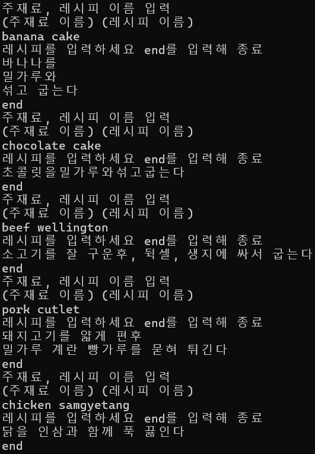
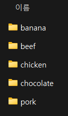
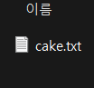
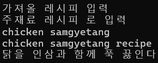
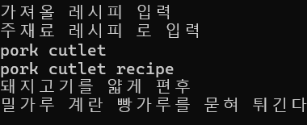
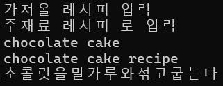
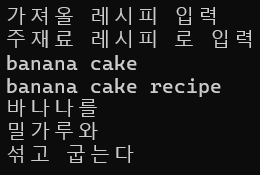

## 중간 보고서
## 2020203090 한용옥

### **1. 제안서 제출 이후 진행상황**

제안서 제출 이후 다음과 같은 핵심 기능들이 구현되었다

**음식 객체**

음식 객체의 필드는 이름, 기한이다
임의 이름과 기한을 받는 생성자를 구현해 사용자 정의 음식을 지원한다

`operator <`를 기한의 순서로 구현하여 두 음식을 기한 기준으로 비교할 수 있다

**자동 정렬 냉장고 시스템**

`refrigerator` 클래스를 구현하였다
음식을 담는 컨테이너로 `multiset`을 사용하였다

`multiset`이므로 음식을 개수 제한 없이 담을 수 있다
음식의 이름으로 기한이 가장 적은 객체에 접근, 삭제하는 메서드를 구현하여
실제 냉장고의 행동을 묘사하였다

음식 객체에 수서를 구현하였고, `multiset`이므로 음식을 삽입, 삭제 해도
기한의 정렬이 유지되며 보관된다

모든 음식을 순회하며 기한을 줄이는 메서드를 구현하여 시간의 흐름을 간접적으로 구현하였다

**파일 입출력 시스템**

음식 정보와 레시피를 텍스트 및 바이너리 파일로 저장하고 불러올 수 있는 기능이 구현되었다
이를 통해 프로그램을 재시작해도 데이터를 유지할 수 있다

아래는 프로그램의 파일 구조이다
```cpp
data  //데이터가 저장되는 파일구조
    |
    food
        | -- chocolate.bin
        | -- banana.bin
    recipe
```

### **2. 최초 계획에서 바뀐 점**

레시피를 `undordered_map`으로 관리하는 부분을 없앴다

레시피는 냉장고에 뭐가 있는지와 관계없이 시스템 자체가 들고 있어야할 정보이다
따라서 레시피를 고유의 파일 구조를 통해 관리하기로 했다

또한 레시피와 음식 간 연결점을 찾기 어려워 주재료-레시피로 관리하기로 했다
```cpp
recipe  //레시피가 저장되는 파일구조
    |
    소고기
        | -- 불고기.txt
        | -- 비프 웰링턴.txt
    닭고기
        | -- 삼계탕.txt
        | -- 치킨.txt
```
레시피를 파일로 저장하되, recipe/주재료 폴더 안에 레시피이름.txt파일로 저장하여
이름만으로 로드하고 점점 업데이트해 레시피를 늘려가기로 했다

### **3. 핵심 기능: 음식 유통기한 자동 정렬 및 감소 기능**

유통기한을 효율적으로 관리하기 위해, 그리고 시간의 흐름을 반영하기 위해
자동 정렬 및 감소기능은 핵심 기능이다

#### 정렬을 위한 자료구조

**multiset의 자동 정렬 이용**
`multiset`은 내부적으로 레드블랙 트리로 구현되어 원소가 삽입될 때마다 자동으로 정렬되는 특성을 가진다
`food` 에 `operator<` 연산자를 오버로딩하여 유통기한 기준으로 정렬되도록 구현했다

```cpp
bool operator <(const food& a, const food& b){
    // 유통기한으로 순서 구현
	return a.get_expiry() < b.get_expiry(); 
}

class refrigerator {
private:
    // 유통기한 기준으로 자동 정렬되는 컨테이너
    multiset<food> expiry_set;
    int length;
};
```

내부적으로 정렬된 상태를 유지하기 때문에
기한이 짧은 음식들을 볼때 앞 부분만 보면 된다는 장점이있다

#### 감소를 위한 핵심 기능

**포인터를 통한 간접 제어**
`multiset`은 원소 수정이 불가능한 자료구조이지만,
`food` 필드에 `shared_ptr`을 사용함으로서 컨테이너 내 원소를
간접적으로 수정할 수 있게 되었다

```cpp
class food {
private:
    string name;
    // 유통기한을 간접적으로 수정하기 위한 스마트 포인터
    shared_ptr<int> expiry;
};
```
**유통기한 감소 메서드**
```cpp
//내장 메서드
void refrigerator::minus_expiry(){
	for (auto& f : expiry_set){
		f.set_expiry(f.get_expiry() - 1);
	}
}
//별도 스레드
void second_work(refrigerator& r) {
    while (true) {
        this_thread::sleep_for(chrono::seconds(1));
        r.minus_expiry();
    }
}
```
별도의 스레드에서 1초마다 모든 음식의 유통기한을 줄인다
`shared_ptr`을 통해 `multiset` 내부 원소를 수정할 수 있다

이러한 방식을 통해 유통기한 감소기능의 시간복잡도가 **O(N)** 이 되어
처음에 생각했던 방식인 멀티셋에서 다 빼서 1 감소 후 넣기인 **O(N * LOG(N))** 보다 효율적이다

이러한 구현을 통해 제안서에서 목표로 했던 **유통기한 자동 정렬 보관** 기능을 효율적으로 구현할 수 있었다
스마트 포인터를 활용한 간접 제어 방식을 통해 STL 컨테이너의 한계를 우회하여 실시간 데이터 수정이 된다

### 4. 기능에 대한 실행화면


사용자 정의 음식을 파일로 저장하는 기능이다


바이너리파일로 잘 저장된 모습이다


사용자로부터 입력을 받아 파일로 저장된 음식을 냉장고에 넣는 모습이다
냉장고 상태를 같이 출력해 기한 기준으로 자동 정렬됨을 알 수 있다


관리를 위해 기한을 감소기키는 기능이다 원소의 순서 변화없이 기한이 감소된다



레시피도 위와 같이 파일로 보관할 수 있다


파일로 저장된 레시피를 잘 불러온다