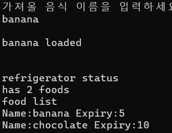

## 중간 보고서
## 2020203090 한용옥

### **1. 제안서 제출 이후 진행상황**

제안서 제출 이후 다음과 같은 핵심 기능들이 구현되었다

**음식 객체 관리 시스템**
`food` 클래스를 구현하여 음식의 이름과 유통기한을 관리할 수 있게 되었다
이 클래스는 음식의 이름과 유통기한을 설정하고 가져오는 메서드를 포함하고 있다
따라서 사용자 정의 음식을 생성, 관리할 수 있습니다

**자동 정렬 냉장고 시스템**
`refrigerator` 클래스를 구현하여 유통기한 기준 자동 정렬이 가능해졌다

**유통기한 감소 기능**
유통기한을 감소하는 기능이 추가되었다
현실에 맞게 음식을 관리 가능하다

**파일 입출력 시스템**
음식 정보와 레시피를 텍스트 및 바이너리 파일로 저장하고 불러올 수 있는 기능이 구현되었다
이를 통해 프로그램을 재시작해도 데이터를 유지할 수 있다

### **2. 최초 계획에서 바뀐 점**

바뀐 점은 없다

### **3. 핵심 기능: 음식 유통기한 자동 정렬 및 감소 기능**

유통기한을 효율적으로 관리하기 위해, 그리고 시간의 흐름을 반영하기 위해
자동 정렬 및 감소기능은 핵심 기능입니다.

#### 정렬을 위한 자료구조

**multiset의 자동 정렬 이용**
`multiset`은 이진 검색 트리로 구현되어 원소가 삽입될 때마다 자동으로 정렬되는 특성을 가진다
`food` 에 `operator<` 연산자를 오버로딩하여 유통기한 기준으로 정렬되도록 구현했다

```cpp
bool operator <(const food& a, const food& b){
    // 유통기한으로 순서 구현
	return a.get_expiry() < b.get_expiry(); 
}

class refrigerator {
private:
    // 유통기한 기준으로 자동 정렬되는 컨테이너
    multiset<food> expiry_set;
    int length;
};
```

#### 감소를 위한 핵심 기능

**포인터를 통한 간접 제어**
`multiset`은 원소 수정이 불가능한 자료구조이지만,
`food` 필드에 `shared_ptr`을 사용함으로서 컨테이너 내 원소를 간접적으로 수정할 수 있게 되었다

```cpp
class food {
private:
    string name;
    // 유통기한을 간접적으로 수정하기 위한 스마트 포인터
    shared_ptr<int> expiry;
};
```
**유통기한 감소 메서드**
```cpp
//내장 메서드
void refrigerator::minus_expiry(){
	for (auto& f : expiry_set){
		f.set_expiry(f.get_expiry() - 1);
	}
}
//별도 스레드
void second_work(refrigerator& r) {
    while (true) {
        this_thread::sleep_for(chrono::seconds(1));
        r.minus_expiry();
    }
}
```
별도의 스레드에서 1초마다 모든 음식의 유통기한을 감소시킵니다.
`shared_ptr`을 통해 `multiset` 내부 원소를 수정할 수 있다

이러한 방식을 통해 유통기한 감소기능의 시간복잡도가 **O(N)** 이 되어
처음에 생각했던 방식인 멀티셋에서 다 빼서 1 감소 후 넣기인 **O(N * LOG(N))** 보다 효율적이다

이러한 구현을 통해 제안서에서 목표로 했던 **유통기한 자동 정렬 보관** 기능을 효율적으로 구현할 수 있었다
특히 스마트 포인터를 활용한 간접 제어 방식은 STL 컨테이너의 한계를 우회하여 실시간 데이터 수정을 가능하게 했다

### 4. 기능에 대한 실행화면


사용자 정의 음식을 파일로 저장하는 기능이다


바이너리파일로 잘 저장된 모습이다


사용자로부터 입력을 받아 파일로 저장된 음식을 냉장고에 넣는 모습이다
냉장고 상태를 같이 출력해 기한 기준으로 자동 정렬됨을 알 수 있다


관리를 위해 기한을 감소기키는 기능이다 원소의 순서 변화없이 기한이 감소된다